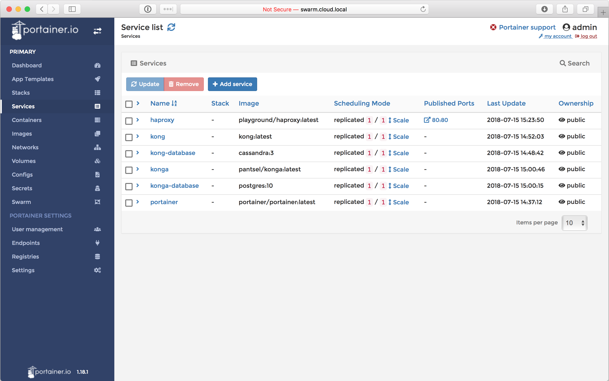
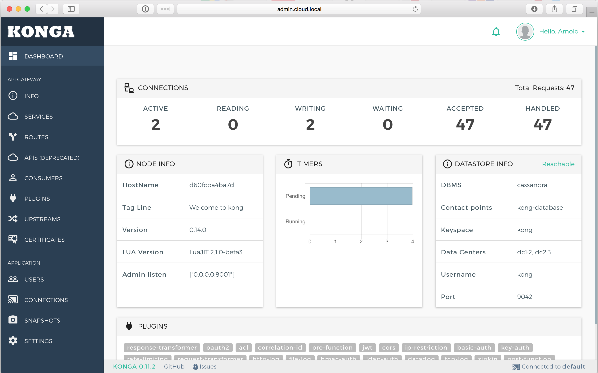

# Playing with Micro Services
This is a small task that I gave to a friend of mine that is learning C# but I also decided to implement it on my own way.
I know it could be simple, but why not try to match a _cloud_ environment, right?

## Requirements
I told him that I'd like:
- two microservices in .Net core
- services should communicate to each other via a message broker like kafka or rabbitmq.
- the api's should be exposed via an API Gateway (I did suggest kong for this)
- Everything using containers

## Preparing the _cloud_ environment locally

For this sample, I'll be using docker in swarm mode. So, let's start by creating our swarm. Along with the swarm, we will also create two networks, one named _admin_ and another network named _playground_.
The _admin_ network will host our cloud tools and the default proxy, and the _playground_ network will host our services. This is important so we know that our services can't mess up with our administration tools. Both networks will be configured as _attachable_ networks, this way we can easily spin containers to perform administrative tasks and sometimes, debugging tasks too.

```bash
$ docker swarm init
$ docker network create -d overlay --attachable admin
$ docker network create -d overlay --attachable playground
```

The first piece of our stack is [_portainer_](https://portainer.io). Portainer is a management UI for swarm. This comes handy whenever you need to see the status of your custer and which services are running without using a shell. This is not a mandatory tool, but I like to use it to inspect the swarm, check logs, access a container, etc.

```bash
$ docker volume create portainer_data
$ docker service create \
    --name portainer \
    --network admin \
    --replicas=1 \
    --constraint 'node.role == manager' \
    --mount 'type=bind,src=/var/run/docker.sock,dst=/var/run/docker.sock' \
    --mount 'type=volume,src=portainer_data,dst=/data' \
    portainer/portainer -H unix:///var/run/docker.sock
```

After you have created both the volume and the service, you can inspect the status of the service by running _docker service ls_. The output should be something like shown below:

```bash
ID                  NAME                MODE                REPLICAS            IMAGE                        PORTS
4ivc2kw4uoes        portainer           replicated          1/1                 portainer/portainer:latest
```

Running _docker service ls_ is how we check the status of the services in our swarm.

The next step is to deploy our _API Gateway_. Here I will use [_kong community edition_](https://konghq.com/kong-community-edition/). For this example, I'm using volumes for everything, but you can also bind to local folders and use your backup procedures as well.
Kong runs on top of _nginx_ and acts as a proxy for your services. We will not go deep on it's features, but I really encourage you to read the [docs](https://docs.konghq.com).

The deployment for kong will happen in three steps:

- Kong Database

    Kong can run on top of cassandra or postgres. I'm using postgres here, so we don't need to fetch another image...

    ```bash
    $ docker volume create kong_data
    $ docker service create \
        --name kong-database \
        --network admin \
        --mount 'type=volume,src=kong_data,dst=/data' \
        -e 'POSTGRES_USER=kong' \
        -e 'POSTGRES_DB=kong' \
        -e 'POSTGRES_DB=kong' \
        -e 'PGDATA=/data' \
        postgres:10
    ```

- Kong Database Migration

    As an intermediate step, we will seed/prepare the database to run kong. We will use an ephemeral container attached to the same network. This container will get destroyed once it finishes running.

    ```bash
    $ docker run --rm \
        --name kong-migrations \
        --network admin \
        --link kong-database:kong-database \
        -e 'KONG_DATABASE=postgres' \
        -e 'KONG_PG_HOST=kong-database' \
        -e 'KONG_PG_USER=kong' \
        -e 'KONG_PG_PASSWORD=kong' \
        -e 'KONG_PG_DATABASE=kong' \
        kong kong migrations up
    ```

    You will see several messages about migrations and in the end your terminal will be freed. This is a sign that we are okay to proceed.

- Kong

    This is basically the deployment of kong. It needs to be attached to both _admin_ and _playground_ networks, as it needs to access the database, and be exposed by our proxy (more on this later), and also be able to access our services.

    ```bash
    $ docker service create \
        --name kong \
        --network admin \
        --network playground \
        -e 'KONG_DATABASE=postgres' \
        -e 'KONG_PG_HOST=kong-database' \
        -e 'KONG_PG_USER=kong' \
        -e 'KONG_PG_PASSWORD=kong' \
        -e 'KONG_PG_DATABASE=kong' \
        -e 'KONG_PROXY_ACCESS_LOG=/dev/stdout' \
        -e 'KONG_ADMIN_ACCESS_LOG=/dev/stdout' \
        -e 'KONG_PROXY_ERROR_LOG=/dev/stderr' \
        -e 'KONG_ADMIN_ERROR_LOG=/dev/stderr' \
        -e 'KONG_ADMIN_LISTEN=0.0.0.0:8001' \
        -e 'KONG_ADMIN_LISTEN_SSL=0.0.0.0:8444' \
        -e 'KONG_PROXY_LISTEN=0.0.0.0:8000' \
        -e 'KONG_PROXY_LISTEN_SSL=0.0.0.0:8443' \
        kong
    ```

Kong is done, but the community version doesn't come with a UI. So, let's grab an open-source solution for it. We will use [_konga_](https://pantsel.github.io/konga/).

- Konga Database

    Konga uses a postgres database to store some credentials and preferences.

    ```bash
    $ docker volume create konga_data
    $ docker service create \
        --name konga-database \
        --network admin \
        --mount 'type=volume,src=konga_data,dst=/data' \
        -e 'POSTGRES_USER=konga' \
        -e 'POSTGRES_DB=konga' \
        -e 'POSTGRES_DB=konga' \
        -e 'PGDATA=/data' \
        postgres:10
    ```

- Konga deployment

    No secrets here either. It will take kare of seeding the database and being available.

    ```bash
    $ docker service create \
        --name konga \
        --network admin \
        -e 'DB_ADAPTER=postgres' \
        -e 'DB_HOST=konga-database' \
        -e 'DB_PORT=5432' \
        -e 'DB_USER=konga' \
        -e 'DB_PASSWORD=konga' \
        -e 'DB_DATABASE=konga' \
        pantsel/konga npm run prepare
    ```
Finally, we are done with most of the admin services. When I _most_ is because we didn't expose any ports yet, which means we can't access _Kong_, _Konga_ nor _Portainer_ from our browser.
To achieve that, I like to spin an [_haproxy_](https://haproxy.com) container with some basic configuration. The [_haproxy.cfg_](./config/haproxy.cfg) file contains all those three backends responding to:
- swarm._yourdomain_ - Exposes _Portainer_
- admin._yourdomain_ - Exposes _Konga_
- _yourdomain_ - exposes kong services

Since this is a customized _haproxy_, we need to build the image and deploy it.

```bash
$ docker build -f haproxy.dockerfile . -t playground/haproxy
$ docker service create \
    --name haproxy \
    --network admin \
    --publish 80:80 \
    playground/haproxy
```
In my case, I'm using _cloud.local_ pointing to _127.0.0.1_ on my hosts file. So, to have everything working properly on your end as well, let's add the following to the hosts file.

```
127.0.0.1       cloud.local
127.0.0.1       admin.cloud.local
127.0.0.1       swarm.cloud.local
```

Now, finally you should be able to access all three services.
Go to _admin.cloud.local_ and portainer will prompt you to create a user and password. Do it and, and go to the services section. YOu should see something like this:



Great, we can see all of our services, now head to _admin.cloud.local_, and login with the default admin user, which is **_admin_** with the password as **_adminadminadmin_**. Click the connections link, on the left menu, and click the activate button. It should just activate the default kong backend on your UI.



To verify _kong_, just go to _http://cloud.local_ and a message like **_{"message":"no route and no API found with those values"}_** should be displayed.

## The Pub/Sub asp.net core application

Yeah, I almost forgot that we needed to deploy the .net application. This is a basic example using RabbitMQ and two aspnet core applications. One acting as a producer, and another acting as a consumer using a hosted service for the consumer. You can check the code in the sources folder.

IMPORTANT: Remember that from this point onwards we should only use the _playground_ network.

- Let's build the images

    ```bash
    $ docker build -f service1.dockerfile . -t playground/service1
    $ docker build -f service2.dockerfile . -t playground/service2
    ```

- And deploy RabbitMQ along with the services.

    ```bash
    $ docker service create \
        --name rabbitmq \
        --network playground \
        -e 'RABBITMQ_DEFAULT_USER=playground' \
        -e 'RABBITMQ_DEFAULT_PASS=letsplay' \
        rabbitmq:3.7.7-alpine

    $ docker service create \
        --name service1 \
        --network playground \
        -e 'RabbitMQConnectionString=host=rabbitmq;username=playground;password=letsplay' \
        -e 'ASPNETCORE_ENVIRONMENT=Development' \
        playground/service1

    $ docker service create \
        --name service2 \
        --network playground \
        -e 'RabbitMQConnectionString=host=rabbitmq;username=playground;password=letsplay' \
        -e 'ASPNETCORE_ENVIRONMENT=Development' \
        playground/service2
    ```

Okay, applications deployed, and now what? How to test it?
1. Go to _admin.cloud.local_, go to services and click _ADD NEW SERVICE_;
2. Set the service name as _service1_, and fill the URL field with _http://service1/api_, then click the button _SUBMIT SERVICE_;
3. Now, click services, go to _ROUTES_ and click _ADD ROUTE_;
4. Just fill the field _Paths_ with _/service1_, hit enter (yes, you do need to press enter here), then click _SUBMIT ROUTE_;

# Congratulations, You are done!
Now if you go to _http://cloud.local/service1/values_ you should see the default output from the api exposed by service1.

To check that the Pub/Sub works, go to _http://cloud.local/service1/values/15_ and run the following command:

```bash
$ docker service logs service2
```

You will see something like this:
```
service2.1.qg4vl0cgrz1a@linuxkit-025000000001    | dbug: service2.Handlers.SampleEventHandler[0]
service2.1.qg4vl0cgrz1a@linuxkit-025000000001    |       AddItem => 15
```

This means that it heard the event with value _15_ posted by _service1_ to _RabbitMQ_.

Hope you liked it...
